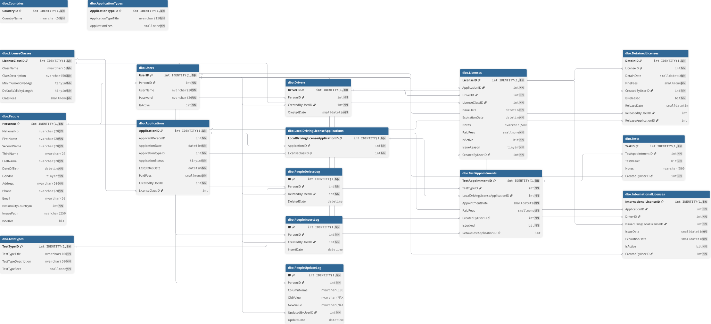

# 🪪 DVLD Driving License Management System

## A desktop application designed to manage the issuance and renewal of various types of driving licenses, providing an environment that facilitates handling driver data and requests.

## 🚀 Core Services

- 🆕 Issue a new driving license for the first time.
- ♻️ Renew an expired license.
- 🔁 Replace a lost or damaged license.
- 🌍 Issue an international driving license.
- 🔓 Release a suspended license.

---

## ⚙️ Technologies Used

- **C#** with **.NET Framework**
- **Windows Form**
- **SQL Server** for data management and storage

---

## 🎯 Features

- 🖥️ Simple graphical interface for adding drivers and managing all types of requests.
- ✅ Internal verification system to ensure requests meet conditions and regulations before execution.
- 📋 Clear data organization with easy browsing and searching.

---

## � Featured Code

### Delegate Pattern for Component Communication

The `UserConShopPersonDetailWithFilter` control uses a delegate to send PersonID back to parent forms:

```csharp
public delegate void DelSendPersonIDBack(int PersonID);
public DelSendPersonIDBack SendPersonIDBack;

private void _SendPersonID()
{
    if (SendPersonIDBack != null) 
        SendPersonIDBack.Invoke(PersonID);
}
```

This enables flexible parent-child communication without tight coupling.

---

## 🚀 Preview

**Featured screens:**

- [Login](https://drive.google.com/file/d/1NAI7zFQeRH2M22WGtmpxVeOpDTv-RYv3/view?usp=drive_link)
- [Home](https://drive.google.com/file/d/1X6llV_rLHUgL0FV5qNlzEl2ImL92WQMK/view?usp=drive_link)
- [Driving License Service](https://drive.google.com/file/d/1Ii3e8dr7y8NkRQ8y1LufIpC_PpOs2i0Z/view?usp=drive_link)
- [Detain License](https://drive.google.com/file/d/1oznx6fQ1jrQbXT0_qRqsVcr07goRYKh1/view?usp=drive_link)
- [Drivers](https://drive.google.com/file/d/1PmtJmigdNjvdM8ZoB12QoNGd9bP3StHH/view?usp=drive_link)
- [Mange Users](https://drive.google.com/file/d/1B2DJ8vjlsVLtZkxxx9safmaLsqF23-GY/view?usp=drive_link)
- [New Local Driving License](https://drive.google.com/file/d/1d7tjHa3x_VBoMn0bT9teGyolFh8VBwNH/view?usp=drive_link)

---

## How to Run the App


## 🗄️ Essential Prerequisite: Database Restoration

Before executing the application via any method, you must restore the SQL Server database backup file (`DVLD Database/DVLD.bak`) provided with the project.
Open **SQL Server Management Studio (SSMS)** and restore the database.

---

### 📁 Method 1: Running the Application Instantly via `.exe` File

_(Best for quick testing, product demonstrations, or QA teams who do not need to view or modify the source code)_

1. Install exe. file from `Distributions/Production-Ready.zip`
2. Double on setup, then go to "Application Files/DVLD_1_0_0_1/DVLD.exe.config.deploy"
3. Update Connection String: Locate the `<connectionStrings>` block and modify the `connectionString` attribute to match your local SQL Server environment data source and authentication credentials:
   ```xml
   <connectionStrings>
       <add name="DVLDconnection"
            connectionString="Server=YOUR_SERVER_NAME;Database=DVLD;User Id=sa;Password=YOUR_PASSWORD;"
            providerName="System.Data.SqlClient"/>
   </connectionStrings>
   ```

### 💻 Method 2: Running & Exploring the Project via Visual Studio

_(Best for software engineers who want to review architecture patterns, inspect code layers, or extend functionalities)_

1. Open Solution: Launch Visual Studio 2022 (or your preferred compatible IDE) and open the main solution file: `DVLD.sln.`

2. Open the development configuration file: `App.config.` to configure the connection string: Modify the connection settings under the <connectionStrings> section to point to your active database server instance:

### 🔑 Default Administrator Credentials

- Username: U2
- Paaword: 123

---

## 📊 Database Schema Diagram



- See PDF and PNG versions in: `Database Schema Diagram` Folder.

---

## 📁 Folder Structure

### **DVLD**

```
DVLD
│   DVLD.sln
│   MainForm.cs
│   Program.cs
│
├── Applications
│   ├── International License
│   │       FormAddNewInternationlalLicense.cs
│   │       FormInternationalLicenseApplications.cs
│   │       UserControlShowInternationalLincenseApplicationDetails.cs
│   │
│   ├── Mange Application Types
│   │       FormApplicationsTypes.cs
│   │       FormEditApplicationsType.cs
│   │
│   ├── Mange Local Driving Applications
│   │       FormAddLocalLicense.cs
│   │       FormEditeLocalDrivingLicenseApplication.cs
│   │       FormShowApplicationDetails.cs
│   │       MangeLoacalDrivingLicenseApplications.cs
│   │       UserConShowLocalApplicationInfo.cs
│   │
│   ├── Release Detaind License
│   │       FormManageDetainLicense.cs
│   │       FormReleaseLicense.cs
│   │       Controls
│   │           UserControlDetainInfo.cs
│   │           UserControlReleaseLicense.cs
│   │
│   ├── Renew Local License
│   │       FormRenwedLicense.cs
│   │       UserControlShowRenwedApplicationsInfo.cs
│   │
│   └── Replacement For Lost or Damaged
│           FormReplacementForDamagedOrLostLicenses.cs
│           UserControlShowReplacementApplicationDetails.cs
│
├── Drivers
│       FormDrivers.cs
│
├── Driving Licenses Services
│       FormAddLocalLicense.cs
│
├── Global Classes
│       clsGlobal.cs
│       clsUtil.cs
│       clsValidatoin.cs
│
├── License
│   │   FormShowPersonLicensesHistory.cs
│   │
│   ├── Detain License
│   │       FormDetainLicense.cs
│   │
│   ├── International License
│   │       FormShowInternatonalLicenseInfo.cs
│   │       Controls
│   │           UserControlShowInternationalLicenseDetails.cs
│   │
│   └── Local License
│           FormIssuDrivingLicenseForTheFirstTime.cs
│           FormShowLicense.cs
│           Controls
│               UserControlDrivingLicenseInfo.cs
│
├── Login
│       FormLoginScreen.cs
│
├── People
│   │   AddEditPerson.cs
│   │   FormShowPersonDetails.cs
│   │   MangePeople.cs
│   │
│   └── Controls
│           ucnAddEitedPerson.cs
│           UserConShopPersonDetailWithFilter.cs
│           UserControlShowPersonDetails.cs
│
├── Tests
│   │   FormAddUpdateApointment.cs
│   │   FormListAppointmentTest.cs
│   │   FormTakeTest.cs
│   │
│   └── Test Types
│           FormEditTestType.cs
│           FormTestTypes.cs
│
└── Users
        FormAddEditUser.cs
        FormChangePassword.cs
        FormMangeUsers.cs
        FormShowUserDetails.cs
        UserControlUserDetails.cs

```

### **Business Layer**

```
clsBusinessLayer
│   clsApplication.cs
│   clsApplicationType.cs
│   clsCountry.cs
│   clsDetainLicense.cs
│   clsDriver.cs
│   clsInternationalLicense.cs
│   clsLicense.cs
│   clsLicenseClasses.cs
│   clsLicenseClassesBusinnessLayer.cs
│   clsLocalDrivingLicensesApplication.cs
│   clsLocalDrivingLicenseViews.cs
│   clsPerson.cs
│   clsTest.cs
│   clsTestAppointment.cs
│   clsTestType.cs
│   clsUser.cs
│   clsViews.cs
│   clsViewsBusinessLayer.cs
│   DVLD_Buisness.csproj

```

### **Data Access Layer**

```
clsDataAccessLayer
│   clsApplicationsDataAccess.cs
│   clsApplicationTypesDataAceess.cs
│   clsCountriesDataAccess.cs
│   clsDataAccessSettings.cs
│   clsDetainLicenseDataAccess.cs
│   clsDriverDataAccess.cs
│   clsGlobalDataAccess.cs
│   clsInternationalLicenseDataAccess.cs
│   clsLicenseClassDataAccess.cs
│   clsLicenseDataAccess.cs
│   clsLocalDrivingLicenseApplicationsDataAccess.cs
│   clsPersonDataAccess.cs
│   clsTestAppointmetsDataAccess.cs
│   clsTestsDataAccess.cs
│   clsTestTypeDataAccess.cs
│   clsUserDataAccess.cs
│   clsViewsDataAccess.cs
│   DVLD_DataAccess.csproj

```

### **Shared**

```
DVLD_Shared
│   ClsGlobal.cs
│   DVLD_Shared.csproj

```

### **People Pictures**

```
│
│

```

---

## 📦 Notes

- The system is desktop-based and does not require an internet connection.
- Can be extended later to integrate with official traffic systems or e-services.

---

## 👨‍💻 Developer

- **Hassan Risan**
- hasan.raisann@gmail.com
- Full-Stack Developer

---

## 📜 License

This project is for educational or experimental purposes.
